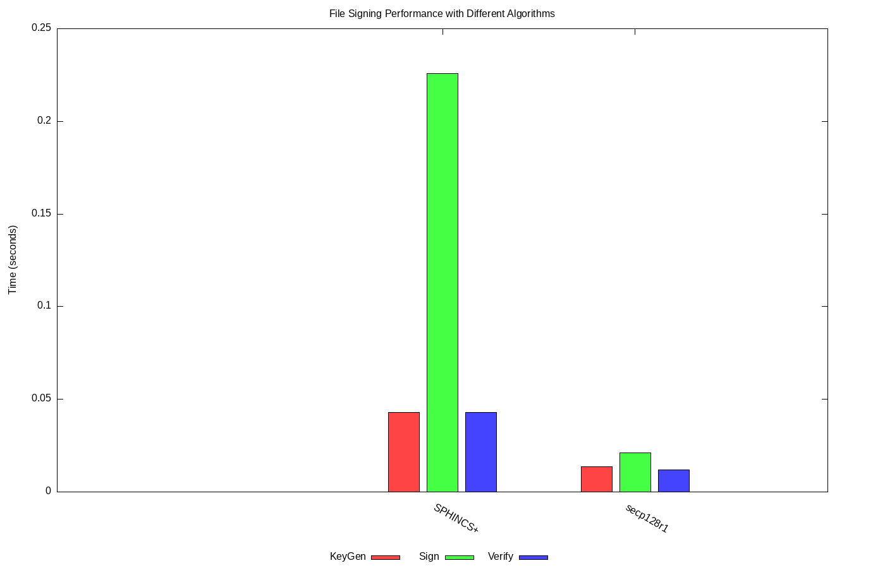

# Lab07 Post-Quantum Cryptography Bonus
**name:** Zakariya Outbih   
**Student ID:** 100184233  
**Date:** 03/23/2025

## Table of contents
1. [Introduction](#introduction)  
2. [Steps](#steps)
3. [Summary of Performance Results](#summary-of-performance-results)


## Introduction

This lab introduced me to quantum resistant algorithms, specifically the SPHINCS+ algorithm. I learned how to generate public and private keys using SPHINCS+ and how to sign and verify files. I did a performance comparison between the SPHINCS+ algorithm and the secp128r1 algorithm.

## Steps

### Step 1: Create sphincs_performance_test.sh

``` vim sphincs_performance_test.sh ```   
``` chmod +x sphincs_performance_test.sh n ```

### Step 2: create measure_time function

#### code is explained in the file

```
measure_time() {
    local start_time=$(date +%s.%N)
    "$@"
    local end_time=$(date +%s.%N)
    echo "$(echo "$end_time - $start_time" | bc)"
}
```

### step 3: create a file for signing 

```
MESSAGE_FILE="message.txt"
echo "Performance test message for SPHINCS+ and ECC (secp128r1)" > "$MESSAGE_FILE"
```

### step 4 run and measure SPHINCS+ key generation

```
SPHINCS_PUB="sphincs_public_key.hex"
SPHINCS_PRIV="sphincs_private_key.hex"
SPHINCS_SIG="sphincs_signature.hex"

SPHINCS_KEYGEN_TIME=$(measure_time python3 -c "
import os, binascii, pyspx.shake_128f as sphincs
seed = os.urandom(sphincs.crypto_sign_SEEDBYTES)
pk, sk = sphincs.generate_keypair(seed)
open('$SPHINCS_PUB', 'w').write(binascii.hexlify(pk).decode())
open('$SPHINCS_PRIV', 'w').write(binascii.hexlify(sk).decode())
")
```

### step 5 run and measure SPHINCS+ signing time

```
SPHINCS_SIGN_TIME=$(measure_time python3 -c "
import binascii, pyspx.shake_128f as sphincs
sk = binascii.unhexlify(open('$SPHINCS_PRIV').read().strip())
msg = open('$MESSAGE_FILE', 'rb').read()
sig = sphincs.sign(msg, sk)
open('$SPHINCS_SIG', 'w').write(binascii.hexlify(sig).decode())
")
```

### step 6 run and measure SPHINCS+ verify time

```
SPHINCS_VERIFY_TIME=$(measure_time python3 -c "
import binascii, pyspx.shake_128f as sphincs
pk = binascii.unhexlify(open('$SPHINCS_PUB').read().strip())
sig = binascii.unhexlify(open('$SPHINCS_SIG').read().strip())
msg = open('$MESSAGE_FILE', 'rb').read()
result = sphincs.verify(msg, sig, pk)
")
```

### step 7 run and measure secp128r1 private key generation time 

```
ECC_KEYGEN_TIME=$(measure_time openssl ecparam -name secp128r1 -genkey -noout -out "$ECC_PRIV")
```

### step 8 run and measure secp128r1 public key extraction time 
```
ECC_PUB_TIME=$(measure_time openssl ec -in "$ECC_PRIV" -pubout -out "$ECC_PUB")
```

### step 9 run and measure signing time using shake128 hash

```
ECC_SIGN_TIME=$(measure_time openssl dgst -shake128 -sign "$ECC_PRIV" -out "$ECC_SIG" "$MESSAGE_FILE")
```
### step 10 run and measure verify time using shake128 hash

```
ECC_VERIFY_TIME=$(measure_time openssl dgst -shake128 -verify "$ECC_PUB" -signature "$ECC_SIG" "$MESSAGE_FILE" -nout)
```
### step 11 output results

```
echo "Performance results:"
echo "SPHINCS+      - KeyGen: $SPHINCS_KEYGEN_TIME s, Sign: $SPHINCS_SIGN_TIME s, Verify: $SPHINCS_VERIFY_TIME s"
echo "secp128r1 - KeyGen: $ECC_KEYGEN_TIME s, Sign: $ECC_SIGN_TIME s, Verify: $ECC_VERIFY_TIME_NUM s"
```

### step 12 write to a .dat file

```
echo "Algorithm KeyGen Sign Verify" > signing_performance.dat
echo "SPHINCS+ $SPHINCS_KEYGEN_TIME $SPHINCS_SIGN_TIME $SPHINCS_VERIFY_TIME" >> signing_performance.dat
echo "secp128r1 $ECC_KEYGEN_TIME $ECC_SIGN_TIME $ECC_VERIFY_TIME_NUM" >> signing_performance.dat

echo "Results saved to performance_results.csv and signing_performance.dat"
```
### step 13 run the script

``` ./sphincs_performance_test.py ```


### step 14 create the gnuplot script

``` vim sphincs_performance_chart.gnu ```

```
set terminal png size 1400,900
set output 'sphincs_performance_chart.png'
set title 'File Signing Performance with Different Algorithms'
set style data histogram
set style fill solid 1.0 border -1
set boxwidth 0.8
set bmargin 8
set lmargin 10
set rmargin 10
set xtics rotate by -30 offset -1.5,-1
set key below
set ylabel "Time (seconds)"

# Define custom colors
set style line 1 lc rgb "#FF4444"  # Red
set style line 2 lc rgb "#44FF44"  # Green  
set style line 3 lc rgb "#4444FF"  # Blue

# Plot multiple columns with different colors
plot 'signing_performance.dat' using 2:xticlabels(1) title "KeyGen" ls 1, \
     'signing_performance.dat' using 3:xticlabels(1) title "Sign" ls 2, \
     'signing_performance.dat' using 4:xticlabels(1) title "Verify" ls 3

```

### step 15 run the gnuplot script

``` gnuplot sphincs_performance_chart.gnu ```

## Summary of Performance Results




| Algorithm   | KeyGen (s) | Sign (s) | Verify (s) |
|-------------|------------|----------|------------|
| SPHINCS+    | 0.0429     | 0.2258   | 0.0430     |
| secp128r1   | 0.0137     | 0.0210   | 0.0120     |

---

## Key Observations

### Key Generation (KeyGen)

- **SPHINCS+**: Takes **0.0429 seconds**.
- **secp128r1**: Takes **0.0137 seconds**.

**Conclusion**: secp128r1 is approximately **~3x faster** than SPHINCS+ for key generation. This is expected because SPHINCS+ is a post-quantum algorithm with larger key sizes, while secp128r1 is a traditional elliptic curve algorithm with smaller key sizes.

---

### Signing (Sign)

- **SPHINCS+**: Takes **0.2258 seconds**.
- **secp128r1**: Takes **0.0210 seconds**.

**Conclusion**: secp128r1 is approximately **~10x faster** than SPHINCS+ for signing. 

---

### Verification (Verify)

- **SPHINCS+**: Takes **0.0430 seconds**.
- **secp128r1**: Takes **0.0120 seconds**.

**Conclusion**: secp128r1 is approximately **~3.5x faster** than SPHINCS+ for verification. 

---

Given the fact that SPHINCS+ is a post quantum encryption algorithm it is expected that it would be more computationally expensive than a standard elliptic curve algorithm like secp128r1